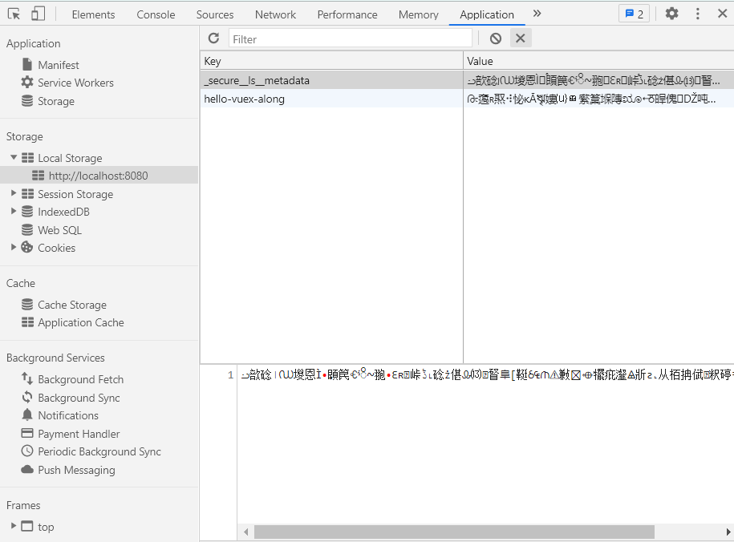

## SecureLS adapter for [vuex-along](https://github.com/boenfu/vuex-along)

```shell
npm install vuex-along-secure-adapter --save
# or
yarn add vuex-along-secure-adapter
```

```javascript
import createVuexAlong from "vuex-along";
import SecureAdapter from "vuex-along-secure-adapter";

const store = new Vuex.Store({
  plugins: [
    createVuexAlong({
      adapterOptions: SecureAdapter(),
    }),
  ],
});
```

More options see [secure-ls](https://github.com/softvar/secure-ls#usage)

## Screenshot



## License

- [MIT](https://opensource.org/licenses/MIT)
